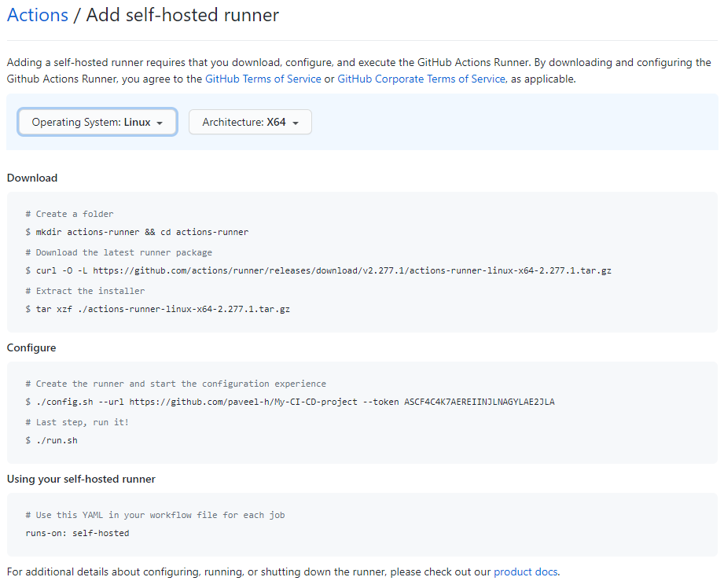
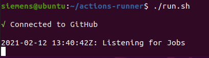
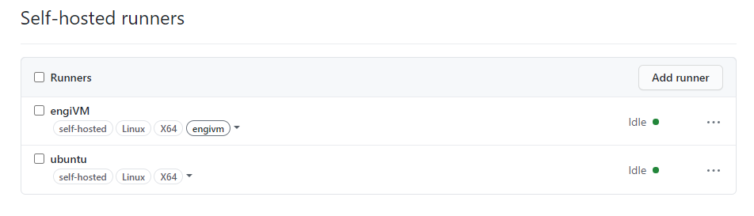

# Installation of GitHub runner

- [Installation of GitHub runner](#installation-of-github-runner)
  - [Self-hosted GitHub runner](#self-hosted-github-runner)
  - [Installation steps](#installation-steps)
  

## Self-hosted GitHub runner 

Further information about installing self hosted runners on your device can be found [here](https://docs.github.com/en/actions/hosting-your-own-runners/about-self-hosted-runners)

You have two options to choose where your pipeline jobs might run. You can either use public GithHub-hosted runner or manage self-hosted runner. For this example, self-hosted runner is used to have connection to Industrial Edge Management system.   

## Installation steps 

*Note:*\
*Ubuntu 20.04 is used for running GitHub runner server*\
*GitHub repository is created*

1) Go to your GitHub repository and click on "Settings". 

2) Click on "Actions" tab in the navigation bar on the left hand side. 

3) Scroll down to the "Self-hosted runners" section and click on "Add runner". 

4) Choose your runners operating system. The instructions for installing and registering self-hosted GitHub runner opens. 



5) Follow the instructions 

    - Download
    ```bash
    mkdir actions-runner && cd actions-runner
    curl -O -L https://github.com/actions/runner/releases/download/v2.277.1/actions-runner-linux-x64-2.277.1.tar.gz
    tar xzf ./actions-runner-linux-x64-2.277.1.tar.gz
    ```
    - Configure 
    ```bash
    ./config.sh --url https://github.com/<yourrepositoryname> --token <yourtoken>
    ```
    - Run the runner 
    ```bash  
    ./run.sh
    ```  

6) You can check whether the installation was successfull in 

    - Terminal
   

    - GitHub
  


