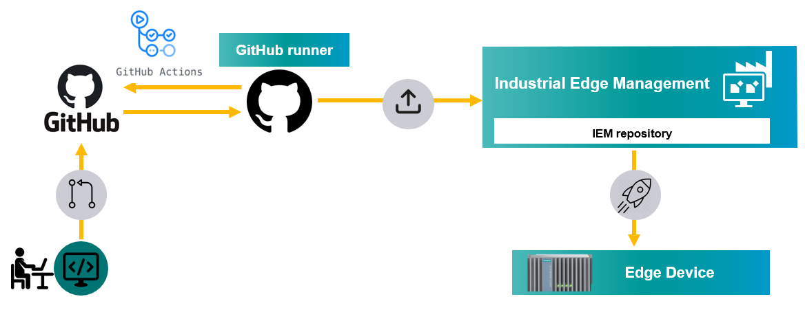

# CI/CD pipelines with GitHUb actions

Automate process of uploading apps to IEM with Github actions

- [CI/CD pipelines with GitHUb actions](#cicd-pipelines-with-github-actions)
  - [Description](#description)
    - [Overview](#overview)
    - [General task](#general-task)
  - [Requirements](#requirements)
    - [Prerequisities](#prerequisities)
    - [Used components](#used-components)
  - [Installation steps](#installation-steps)
  - [Documentation](#documentation)
  - [Contribution](#contribution)
  - [Licence & Legal Information](#licence--legal-information)

## Description

###  Overview
This application example shows how to create  CI/CD pipelines with GitHub actions to automatically upload applications to Industrial Edge Management system.

### General task
This example shows is to show how to setup GitHub runner and create CI/CD pipelines to upload applications to IEM. GitHub provides a tool called GitHub actions which can be used to automate many software workflows including CI/CD pipelines. The advantage of using GitHub actions is that when you have repository already hosted on GitHub and you can also create CI/CD pipelines directly in GitHub so everything is at one place. 

The main goal of this example is to setup the infrustructure as shown below. Whenever the developer pushes the code to the GitHub repository (it is called an event), it triggers a CI/CD pipeline running on GiHub runner, from where it automatically uploads application version to the Industrial Edge Management system.   

## Requirements

###  Prerequisities

- Installed Industrial Edge Management
- Installed system configurators
- Installed system applications
- VM (will be used for GitHub runner) with docker and docker-compose installed
- VM has connection to IEM

### Used components

- Industrial Edge Device V 1.1.0-39
- Industrial Edge Management system V 1.1.11
- VM - Ubuntu 20.04
- Docker 19.03.13

## Installation steps

## Documentation

- You can find further documentation and help in the following links
  - [Industrial Edge Hub](https://iehub.eu1.edge.siemens.cloud/#/documentation)
  - [Industrial Edge Forum](https://www.siemens.com/industrial-edge-forum)
  - [Industrial Edge landing page](https://new.siemens.com/global/en/products/automation/topic-areas/industrial-edge/simatic-edge.html)
  
## Contribution
Thanks for your interest in contributing. Anybody is free to report bugs, unclear documenation, and other problems regarding this repository in the Issues section or, even better, is free to propose any changes to this repository using Merge Requests.

## Licence & Legal Information
Please read the [Legal information](LICENSE.md)