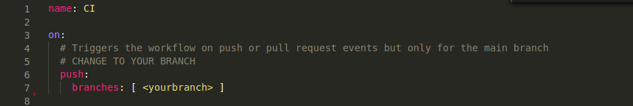

# CI/CD pipelines with GitHub actions 

Automate process of uploading apps to IEM with GitHub actions using shell script or with docker container. To demonstrate this approach, a simple nginx application is used. As a prerequisity for this task, you need to have account on GitHub and self-hosted GitHub runner installed. In order to reproduce this example, follow instructions below. 

- [CI/CD pipelines with GitHub actions](#cicd-pipelines-with-github-actions)
  - [Create project and application in IEM](#create-project-and-application-in-iem)
  - [Create GitHub repository](#create-github-repository)
  - [Shell prerequisities](#shell-prerequisities)
    - [Install IE Publisher CLI on GitHub runner](#install-ie-publisher-cli-on-github-runner)
    - [Expose docker daemon](#expose-docker-daemon)
    - [Customize docker](#customize-docker)
  - [Docker with GitHub actions prerequisities](#docker-with-github-actions-prerequisities)
    - [Push docker image with IE Publihser CLI to docker registery.](#push-docker-image-with-ie-publihser-cli-to-docker-registery)
  - [Create GitHub secrets](#create-github-secrets)
  - [Push application files to the GitHub repository](#push-application-files-to-the-github-repository)


## Create project and application in IEM 
*Prerequisities:*\
*- IEM installed and configured*

1) Go to the "Applications" section of your Edge Management system. 

2) Click on "Create Project" button in the right upper corner. 

3) Provide necessary information for your project 

    ```txt
    - Project Name
    - Description 
    - Company information (if needed)
    ```

4) Click on "Create" to create the project. 


5) Go to your created project and click on "Create application"

6) Fill in the form for your application 


    ```txt
    - Application Name 
    - Repository Name
    - Website
    - Sescription
    - Select icon
    ```

7) Click on "Create" button. Your application is succesfully created.


## Create GitHub repository 
*Prerequisities:*\
*- GitHub account is created*\
*- VS code is used for pushing code to remote GitHub repository*

1) Go to [GitHub](https://github.com/) and sign in with your credentials. 

2) Navigate to your profile and with "plus" button in the right upper corner select "New repository". 

3) Give your repository required information 

    ```txt
    - Repository name
    - Choose public repository
    ```


## Shell prerequisities 

### Install IE Publisher CLI on GitHub runner 

In case you want to use shell script for your pipelines, you have to install Publisher CLI on your self-hosted GitHub runner To install IE Publisher CLI, follow this instruction: 

1) Go to your GitHub runner. 

2) Copy IE Publisher CLI installation [file](../../IE_Publisher_CLI/ie-app-publisher-linux) to your device. 

3) Make sure the file is executable. 


4) Open up terminal in the folder where the istallation file is located and run this command 

    ```bash
    sudo cp ie-app-publisher-linux /usr/bin
    ```

5) To test whether your installation was succesfull run this command:

    ```bash
    ie-app-publisher-linux --version
    ```


6) If you see the publisher CLI version number, you have successfully installed IE Publisher CLI on your device. 

### Expose docker daemon 
In order to run shell script for this example, you need to expose docker daemon TCP port 2375. To do that, follow these instructions: 

1) Open terminal on the device where your GitHub runner is running. 

2) Open the configuration file of the docker service:
    ```bash
    sudo nano /lib/systemd/system/docker.service
    ```

3) In the `[Service]` section, replace the line starting with `ExecStart= ` with the following line:

    ```bash
    ExecStart=/usr/bin/dockerd -H fd:// -H tcp://127.0.0.1:2375
    ```
     In this example the API will listen at `127.0.0.1:2375`. You can change the IP according to your setup, eg if you want to reach the docker engine from a external host, enter the external IP of the host.
4) Save the modified file
5) Reload the systemctl configuration:
   
    ```bash
    sudo systemctl daemon-reload
    ```

6) Restart the docker service:

    ```bash
    sudo systemctl restart docker.service
    ```

7) Check if the new configuration was applied:

    ```bash
    sudo docker info
    ```
     The output should state that the API is accessible on your IP and Port.

__Warning__ : Access to the remote API is equivalent to root access on the host. Only do this in a trusted environment.

### Customize docker


Add user to the docker group to run without sudo command: 

1) Create docker group
   
    ```bash
    sudo groupadd docker
    ```
2) Add your user to the docker group

    ```bash
    sudo usermod -aG docker $USER
    ```

3) Activate the changes to groups

    ```bash
    newgrp docker 
    ```

## Docker with GitHub actions prerequisities 

### Push docker image with IE Publihser CLI to docker registery. 


By default, GitHub actions is pulling docker images from [https://hub.docker.com/](https://hub.docker.com/) to use them within your pipelines. You can also use any of your favourite docker container registery. 

1) Create account and private repository in docker hub. 
2) Push this [docker-image](./src/docker/dockerfile/Dockerfile) to your repository using these commands 


    ```bash
    docker login -u <dockerID> -p <password>
    docker build -t <image> .
    docker push <image>
    ```


## Create GitHub secrets

To use sensitive information in your pipelines, it is convenient to use GitHub secrepts. To use secrets in your pipeline follow these instructions: 


1) Go to the "Settings" section of your GitHub repository. 

2) Click on "Secrets" tab in the left navigation bar. 
3) Click on "New repository secret" button in the right upper corner. 
4) Create secret by defining its "Name" and "Value" property. For this example, Add the following secrets to your project: 

    ```txt
    - Name: IEM_URL
    - Value: <url-of-your-iem>
    ```
    ```txt
    - Name: USER_NAME
    - Value: <ieam-username>
    ```
    ```txt
    - Name: PSWD
    - Value: <iem-password>
    ```
    ```txt
    - Name: APP_ID
    - Value: <application-ID>
    ```
    ```txt
    - Name: DOCKERHUB_USERNAME
    - Value: <dockerhub-username>
    ```
    ```txt
    - Name: DOCKERHUB_PSWD
    - Value: <dockerhub-password>
    ```
    ```txt
    - Name: DOCKER_IMAGE_CLI
    - Value: <docker-image-with-cli>
    ```
*Note: App ID can be found in IEM under "My Projects -> Application Details -> Show Keys"*


## Push application files to the GitHub repository 


1) Clone this repository to your local development device using `git clone <repositoryURL>` command. 

2) Open VS code inside of an empty folder. 

3) Copy application file from either shell or docker (use your prefered one) [src](./src) folder to your empty folder. 

4) Configure `cicd.yml` on push event according to your branch. 



*Important Note!*
If you want to use docker inside your pipeline, specify your docker image with the IE Publisher CLI installed by a name.


This configuration will pull the docker image from your repository on Docker Hub. 


5) Push this code to your repository by running this commands in your terminal: 
   
    ```bash
    cd <yourdirectory>
    git init
    git add --all
    git commit -m "first commit"
    git branch -M main
    git remote add origin https://github.com/<yourrepositoryname>.git
    git push -u origin main
    ```


This action will trigger the pipeline according to your event configuration. Your application should upload to IEM automatically. You can check the results in the "Actions" section of your GitHub perository. 

